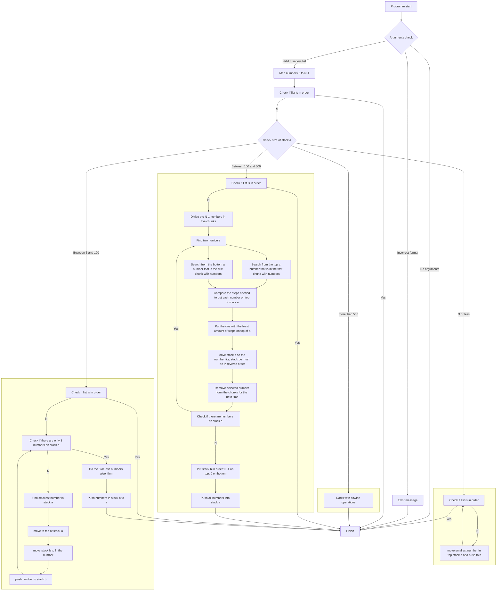

# Logic flowchart

```mermaid
    flowchart TB;
    A[Programm start]-->B{Arguments check};
    B--No arguments-->Z[Finish];
    B--Incorrect format-->D[Error message];
    D-->Z;
    B--Valid numbers list-->E[Map numbers 0 to N-1];
    E-->Y[Check if list is in order];
    Y--Yes-->Z;
    Y--No-->F{Check size of stack a};
    F--3 or less-->G[Check if list is in order];
    F--Between 3 and 100-->R[Check if list is in order];
    F--Between 100 and 500-->I[Check if list is in order];
    F--more than 500-->J-->Z;
    G--Yes-->Z;
    R--Yes-->Z;
    I--Yes-->Z;
    A4-->Z;
    Q-->Z;
    subgraph  ;
        G--No-->K[move smallest number in top stack a and push to b]-->G;
    end;
    subgraph   ;
        R--No-->H[Check if there are only 3 numbers on stack a];
        H--No-->L[Find smallest number in stack a]-->M[move to top of stack a]-->N[move stack b to fit the number]-->O[push number to stack b]-->H;
        H--Yes-->P[Do the 3 or less numbers algorithm]-->Q[Push numbers in stack b to a];
    end;
    subgraph    ;
        J[Radix with bitwise operations];
    end;
    subgraph     ;
        I--No-->S[Divide the N-1 numbers in five chunks];
        S-->A5[Find two numbers];
        A5-->T[Search from the top a number that is in the first chunk with numbers]-->V[Compare the steps needed to put each number on top of stack a];
        A5-->U[Search from the bottom a number that is the first chunk with numbers]-->V;
        V-->W[Put the one with the least amount of steps on top of a];
        W-->X[Move stack b so the number fits, stack be must be in reverse order];
        X-->A1[Remove selected number form the chunks for the next time];
        A1-->A2[Check if there are numbers on stack a];
        A2--Yes-->A5;
        A2--No-->A3[Put stack b in order: N-1 on top, 0 on bottom]-->A4[Push all numbers into stack a];
    end;
```
