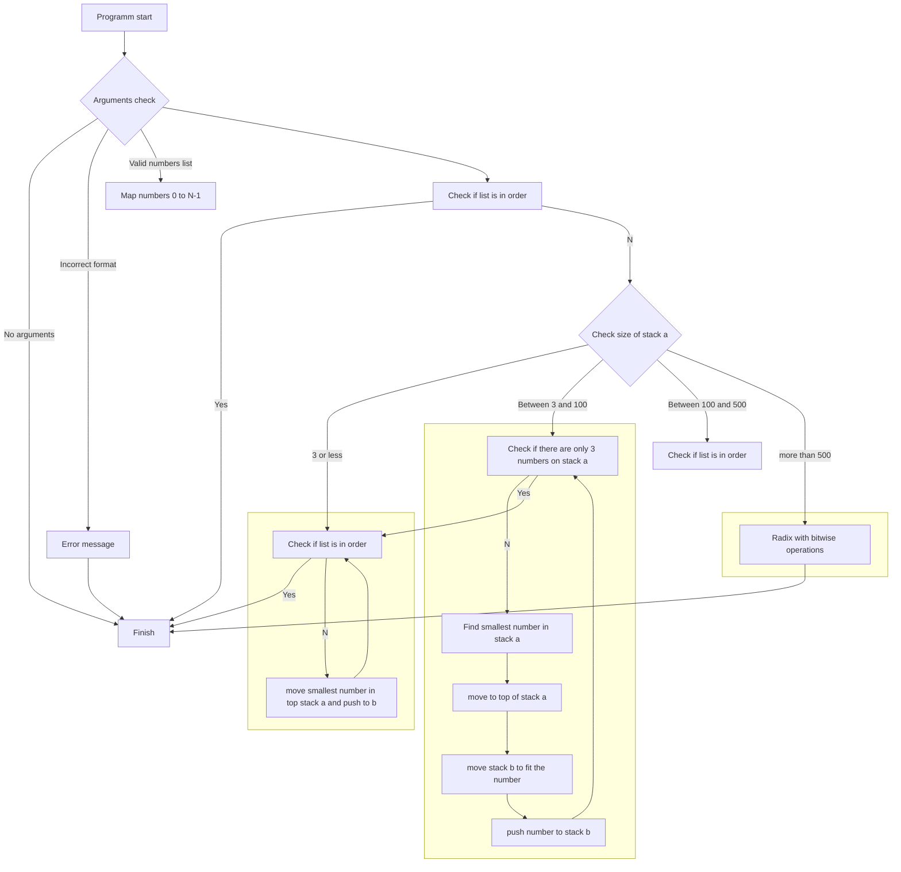

# Logic flowchart

```mermaid
    flowchart TB;
    A[Programm start]-->B{Arguments check};
    B--No arguments-->Z[Finish];
    B--Incorrect format-->D[Error message];
    D-->Z;
    B--Valid numbers list-->E[Map numbers 0 to N-1];
    B-->Y[Check if list is in order];
    Y--Yes-->Z;
    Y--No-->F{Check size of stack a};
    F--3 or less-->G[Check if list is in order];
    F--Between 3 and 100-->H[Check if there are only 3 numbers on stack a];
    F--Between 100 and 500-->I[Check if list is in order];
    F--more than 500-->J-->Z;
    G--Yes-->Z;
    subgraph  ;
    G--No-->K[move smallest number in top stack a and push to b]-->G;
    end;
    subgraph   ;
    H--No-->L[Find smallest number in stack a]-->M[move to top of stack a]-->N[move stack b to fit the number]-->O[push number to stack b]-->H;
    H--Yes-->G;
    end;
    subgraph    ;
    J[Radix with bitwise operations];
    end;
```
